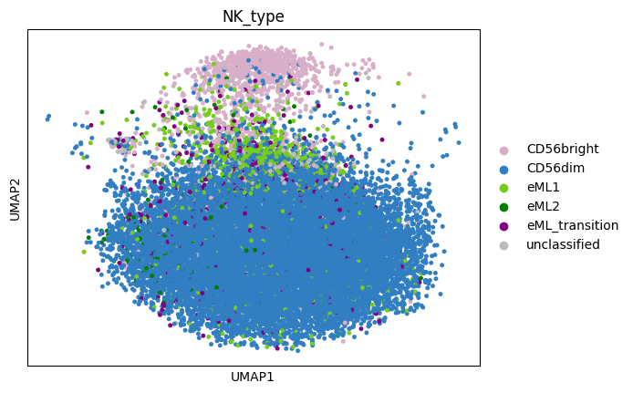
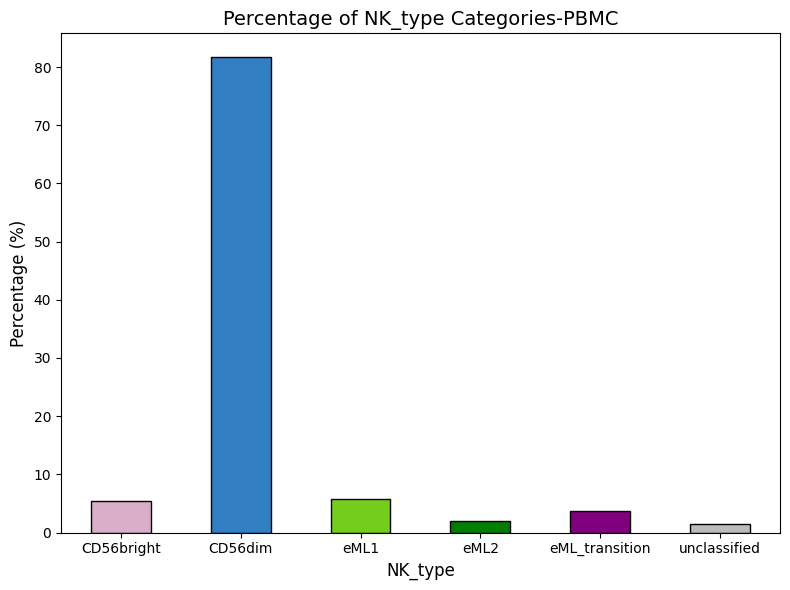

1. Direct Execution
===================

Example run
-----------

To run the tool in batch mode from the command line:

*Example run with H5ad file:*

.. code-block:: bash

   python3 -m eML.classify \
     --batch patient_ID \
     --adata_file /mnt/adata_query.h5ad \
     --proteins_file /app/src/data/proteins_to_check.txt \
     --patient pan_cancer \
     --adversarial_classifier False \
     --output_dir /mnt/output \
     --ref_model /app/src/data/models/totalvi_vae_reference_model_withclassifiers \
     --ref_adata /app/src/data/models/totalvi_vae_reference_model_withclassifiers.h5ad 

*Another example run with CSV files:*

.. code-block:: bash

   python3 -m eML.classify \
     --batch Data.source_Chemistry \
     --RNApath /mnt/rna_counts.csv \
     --metapath /mnt/meta.csv \
     --ref_model /app/src/data/models/totalvi_vae_reference_model_withclassifiers \
     --ref_adata /app/src/data/models/totalvi_vae_reference_model_withclassifiers.h5ad \
     --classifier_type BBC \
     --proteins_file /app/src/data/proteins_to_check.txt \
     --output_dir /mnt/output \
     --patient batch_Datasource

Output File Structure:
----------------------

.. code-block:: text

   output_dir/
   ├── <patient>_arguments_used.txt
   ├── <patient>_prepped.h5ad
   ├── <patient>_probabilities<classifier_type>output.csv
   ├── <patient>_eMLclassified_adata.h5ad
   └── <patient>_vae_model_withclassifiers/
        └── model.pt

Visualize output data
----------------------

*Umap of NK_type in eML_classified_adata:*

.. code-block:: bash

   sc.pl.umap(adata_PBMC_eMLclassified, color='NK_type',  size=45 )

*Barplot of NK_type in eML_classified_adata:*

.. code-block:: bash

   # Define the desired order for NK_type categories
   desired_order = ['CD56bright', 'CD56dim', 'eML1', 'eML2', 'eML_transition', 'unclassified']

   # Define colors for each category using the provided hex codes
   colors = ['#D8AEC8' ,  '#317EC2' , '#74CC1D', '#027D02', 'purple', '#BBBBBC']

   # Calculate the percentage of each NK_type category
   NK_type_counts = adata_PBMC_eMLclassified.obs['NK_type'].value_counts(normalize=True) * 100

   # Reorder NK_type_counts based on the desired order
   NK_type_counts = NK_type_counts[desired_order]

   # Plot the percentages with the desired order and assigned colors
   plt.figure(figsize=(8, 6))
   NK_type_counts.plot(kind='bar', color=colors, edgecolor='black')

   # Customize labels and title
   plt.title('Percentage of NK_type Categories-PBMC', fontsize=14)
   plt.xlabel('NK_type', fontsize=12)
   plt.ylabel( 'Percentage (%)', fontsize=12)
   plt.xticks(rotation=0 )

   # Optimize layout and show the plot
   plt.tight_layout()
   plt.show()

Visualize ouput data more with `Scanpy Documentation <https://scanpy.readthedocs.io/en/stable/>`_.

*Note:*

Slight differences in decimal values (floating-point results) depending on whether computations are performed on a GPU or CPU may be observed.