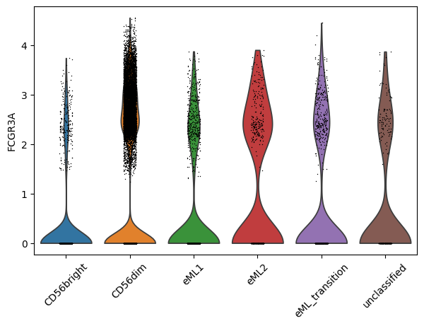
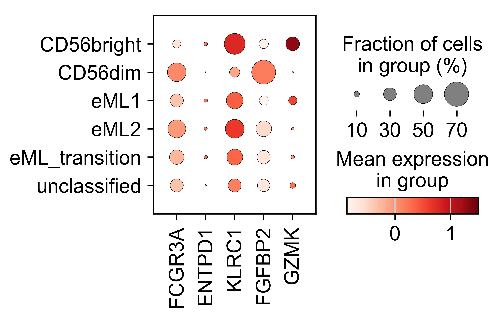

2. Interactive Execution
=========================

You can also run Finding eML interactively using a Python shell.

Example run
-----------

This command starts the Python 3 interactive shell in your terminal. It allows you to run Python code line by line interactively, which is useful for testing or exploring functions in the package.

.. code-block:: python
   
   python3

Once inside Python:

a. *Import Required Modules and Set Working Directory*
   
   The script first imports necessary Python modules and sets the working directory to ensure correct package access.

.. code-block:: python
   
   import os
   import sys
   import eML.classify as eML

b. *Define Command-Line Arguments*

   The classifier requires specific input arguments such as batch information, file paths, patient ID, and model settings.

.. code-block:: python

   sys.argv = ['eML',
      '--batch', 'patient_ID',
      '--adata_file', '/mnt/adata_query.h5ad',
      '--proteins_file', '/app/src/data/proteins_to_check.txt',
      '--patient', 'Malmberg',
      '--adversarial_classifier', 'False',
      '--output_dir', '/mnt/output',
      '--ref_model', '/app/src/data/models/totalvi_vae_reference_model_withclassifiers',
      '--ref_adata', '/app/src/data/models/totalvi_vae_reference_model_withclassifiers.h5ad',
      '--classifier_type', 'BBC']

c. * Required Files*

   Ensures that all necessary files are available before proceeding.

.. code-block:: python

   args = eML.parse_arguments()
   os.makedirs(args.output_dir, exist_ok=True)

d. *Save Arguments for Reproducibility*

   Saves the arguments used for classification to a text file for reference.

.. code-block:: python

   args_file = os.path.join(args.output_dir, f'{args.patient}_arguments_used.txt')

   with open(args_file, "w") as f:
      for key, value in vars(args).items():
         f.write(f"{key}: {value}\n")

e. *Load Proteins to Check*

   Reads the list of proteins that need to be removed.

.. code-block:: python

   proteins_to_check = eML.load_proteins_from_file(args.proteins_file)

f. *Validate Input Files and Load Reference Model*

   Ensures the required input files exist and loads the appropriate reference model.

.. code-block:: python

   eML.validate_files(args.adata_file, args.RNApath, args.metapath, args.umappath, args.ADTpath, args.protein)
   ref_model, ref_adata = eML.get_model_path(args.ref_model, args.ref_adata)

g. *Load and Preprocess Data*

   Loads the AnnData object and applies preprocessing steps required for model training.

.. code-block:: python

   adata, ref, protein_adata = eML.load_data(args.adata_file, ref_adata, args.RNApath, args.metapath, args.umappath, args.ADTpath, args.protein)
   adata = eML.preprocess_data(adata, args.protein, protein_adata, ref, adata.obs, args.batch, proteins_to_check, args.protein_suffix, args.output_dir, args.patient, args.mouse)

h. *Train TOTALVI Model and Classify Latent Space*

   Trains the TOTALVI model and classifies NK cells based on learned latent features.

.. code-block:: python

   vae_q = eML.train_totalvi_model(adata, ref_model, ref, args.adversarial_classifier)
   predictions, probs = eML.classify_latent_space(vae_q, adata, args.classifier_type)

i. *Save Results and Assign Cell Types*

   Saves classification results and assigns NK cell types based on model predictions.

.. code-block:: python

   eML.save_results(adata, predictions, probs, args.output_dir, args.patient, vae_q, args.classifier_type, args.mouse)
   adata = eML.classify_cells(adata, args.classifier_type, args.output_dir, args.patient)

Output File Structure:
----------------------

.. code-block:: text

   output_dir/
   ├── <patient>_arguments_used.txt
   ├── <patient>_prepped.h5ad
   ├── <patient>_probabilities<classifier_type>output.csv
   ├── <patient>_eMLclassified_adata.h5ad
   └── <patient>_vae_model_withclassifiers/
        └── model.pt

Visualize output data
---------------------

*Violin plot of selected gene in NK_type categories:*

.. code-block:: bash

   sc.pl.violin(adata_PBMC, ["FCGR3A"], groupby="NK_type", rotation= 45)

   

*Dotplot of selected genes in NK_type categories:*

.. code-block:: bash

   genes= ["FCGR3A", "ENTPD1", "KLRC1", "FGFBP2", "GZMK"]
      
   # Subset the adata object to include only the valid genes
   adata_valid = adata_PBMC[:, genes]
      
   # Scale the expression data for the valid genes
   sc.pp.scale(adata_valid, zero_center=True, max_value=None)
      
   # Generate a dot plot for the 'NK_type' column
   sc.pl.dotplot(adata_valid, var_names=valid_genes, groupby='NK_type', vmax=1.5, use_raw=False, cmap='Reds')
    

Visualize ouput data more with `Scanpy Documentation <https://scanpy.readthedocs.io/en/stable/>`_.

*Note:*

If you have preprocessed data already, you can initiate with defining command line arguments, loading reference model which is later followed by training the model with it's next steps in interactive session.

